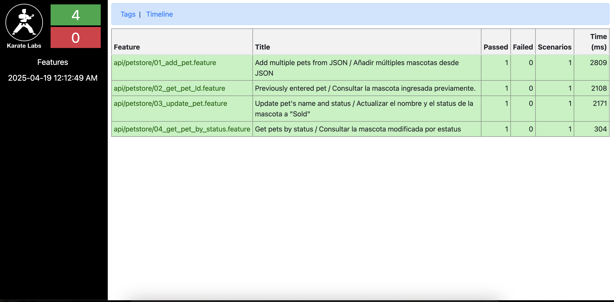
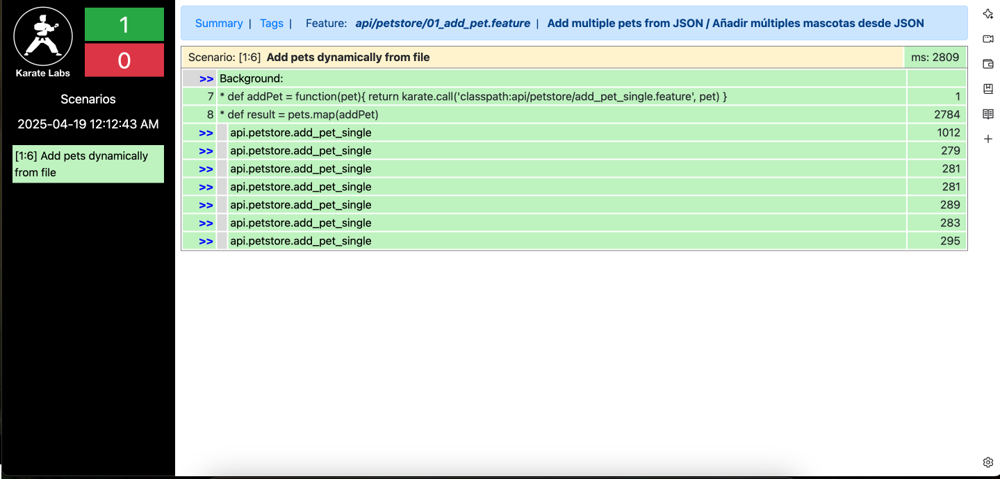

# **Ejercicio Petstore Swagger - README**

### **Descripción**

Este proyecto implementa pruebas automatizadas de API utilizando **Karate** para interactuar con el servicio de **Petstore Swagger**. Los escenarios de prueba incluyen:

1. **Añadir una mascota a la tienda**.
2. **Recuperar la mascota previamente añadida por su ID**.
3. **Actualizar el nombre y el estado de la mascota a 'Sold'**.
4. **Consultar la mascota modificada por su estado (buscar por estado)**.

### **Instrucciones para la ejecución**

#### **Requisitos**

- **Java JDK 11+** instalado y configurado en el sistema.
- **Maven** instalado y configurado en el sistema.
- **Karate** configurado en el proyecto.
- Editor de código compatible como **PyCharm** o **IntelliJ IDEA**.

### **Pasos para configurar y ejecutar el proyecto**

1. **Clonar el repositorio**  
   Clona el repositorio público desde GitHub. El enlace al repositorio será provisto en la entrega final.

   ```bash
   git clone https://github.com/Xaler01/PruebaTecnica
   cd Petstore
   
2. **Compilar el proyecto con Maven**  
   Navega hasta el directorio raíz del proyecto y compilar:

    ```bash
   mvn clean install

3. **Ejecutar las pruebas de Karate**  
Una vez instalado todo se puede ejecutar los casos de prueba definidos en los archivos .feature de Karate. 

     ```bash
     mvn test

4. **Generación de Reportes**  
Los reportes de las pruebas se generarán automáticamente en el directorio target/karate-reports. Para visualizar los reportes de HTML se debe abrir el archivo karate-summary.html en un navegador.

    ```bash
    open target/karate-reports/karate-summary.html
  
5. **Imagenes de ejemplo de reporte con Karate**  

     
6. 
   